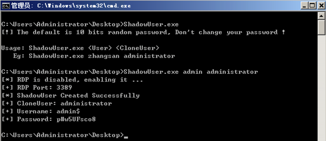

### Introduce

**ShadowUser.exe   (.NET Framework 2.0)**

```tex
[!] The default is 10 bits random password, Don't change your password !

Usage: ShadowUser.exe <User> <CloneUser>
   Eg: ShadowUser.exe zhangsan administrator
```



1. 查询RDP状态与端口，关闭状态可开启；

2. 注册表导入用户，`net user`无法删除，需要删除注册表相关键值；

3. Windows 的登录界面不显示该用户信息。

------

### Reference

- [Windows-User-Clone.ps1](https://github.com/3gstudent/Windows-User-Clone/blob/master/Windows-User-Clone.ps1)
- [权限维持篇-影子用户后门](http://hackergu.com/power-shadowuser/)
- [渗透技巧——Windows系统的帐户隐藏](https://3gstudent.github.io/3gstudent.github.io/%E6%B8%97%E9%80%8F%E6%8A%80%E5%B7%A7-Windows%E7%B3%BB%E7%BB%9F%E7%9A%84%E5%B8%90%E6%88%B7%E9%9A%90%E8%97%8F/)